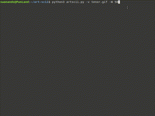

# ART-SCII

### Enjoy the world of ascii art

```

 AA  RRRR  TTTTTT      SSS   CCC III III 
A  A R   R   TT       S     C     I   I  
AAAA RRRR    TT   ---  SSS  C     I   I  
A  A R R     TT           S C     I   I  
A  A R  RR   TT       SSSS   CCC III III

```

## What can it do? :art:

- Convert a local / from url image to ascii art.
- Play a video / gif in ascii art.
- See yourself live in ascii art using webcam.

## Requirements :books:
- Pillow (PIL)
- OpenCV (cv2)
- Requests
- Time
- Argparse

## Usage :crossed_swords:
- Image to ascii art `artscii.py -i image.png`
- Image from url : `artscii.py -u url`
- Video : `artscii.py -v video.mp4`
- webcam : `artscii.py -w`
- Set custom width and height for output (default W = 70) : `artscii.py -w -W 50 -H 50`
- Use more characters for shading : `artscii.py -i image.png -m`

## TO-DO :telescope:
- Add audio support
- Improve error handeling
- Print characters in colour

## Contributing :man_technologist:
Feel free to fork and issue pull requests. <3

## Support :chart_with_upwards_trend:
Let me know if you like it <3.
Support in whatever way you can :trophy:
